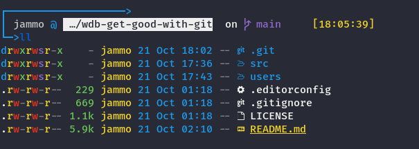

## Wednesday, October 20, 2021 @ 08:38:30 PM

Welcome to our new repo, where **we all** learn to get good with `git` 😁

As you all know, using `git` in a work environment is crucial for a Web Developers workflow. It is even more important when working with others.

**I DO NOT** claim to know everything there is to know about `git`, as I have only ever used it in my own [personal projects](https://github.com/jjaimealeman).

The purpose of this repo is for **us/we/me/you** to learn the basics of using `git`, both for personal use as well as in a team environment.

---

> ## This is my first ever collaborative repo working with others. So forgive me as I learn how to manage the collaborative tools that Github has to offer.

---

## First Steps:

1. Watch this repo.
2. Fork this repo.
3. Clone your repo.

If you are an absolute beginner and know nothing about `git`, then I encourage you to check out [these GitHub docs](https://docs.github.com/en/get-started/using-git).

---

## Commands to get your started

These **9 commands** are absolutely the BASIC ones you will most likely use for this project repo.

> `git init` ; `git clone` ; `git add` ; `git commit` ; `git status` ; `git branch` ; `git merge` ; `git pull` ; `git push`

I have used these for years and type them a hundred times per day.

> ### Below I will share some screenshots to better display the `git` commands and their output.

> ## **The output in your terminal will be different than mine!**
>
> ## I've modified mine for personal satisfaction. Dotfiles available upon request.

1. `git init`
    > The subcomand `init` is short for "initialize".
    >
    > When you type this command in a new folder, this "initializes" a `git` repository and begins tracking the files in that folder. It will create a hidden folder called `.git` that contains the directory structure for your project version control.
    >
    > You can now continue working on your project, create, edit, delete, and move files around. As you make changes, you are encouraged to `add` and `commmit` regularly, so you can always track your progress and create "snapshots" of your code as your project grows.
    >
    > In this screenshot, before I run `git init`, I run the command `ll`. In Linux that command says "List Files". After `ll` I run `git init` and you see the following when I run `ll` again, it shows a folder called `.git` in the new-test-folder`.
    >
    > 
2. `git clone`

    > This will make a copy of a remote repo on your local machine. This will contain all the files and folder structure, the entire commit history and the branches.
    >
    > You have several options when it comes to cloning a repo.
    >
    > > Option 1: **Default method**
    > >
    > > This will clone this repo into a new folder that I chose to name "wdb-get-good-with-git".
    > >
    > > When you `cd` into that folder, you will see all the project files and folders.
    > >
    > > `git clone https://github.com/jjaimealeman/wdb-get-good-with-git.git`
    >
    > 

    ***

    > > Option 2: **Clone into your own folder root**
    > >
    > > Create your own folder and run the command there.
    > >
    > > `git clone https://github.com/jjaimealeman/wdb-get-good-with-git.git .`

    ***

    > > Option 3: **Rename the folder**
    > >
    > > This will clone this repo into a new folder called "name-of-new-folder".
    > >
    > > `git clone https://github.com/jjaimealeman/wdb-get-good-with-git.git name-of-new-folder`

    ***

3. `git status`

    > As you make your changes, and you create & delete files, `git` will keep track of everything.
    >
    > It will track new files that have not been added. It will track files that have been deleted. And of course it will track files that have been modified.
    >
    > Here you see that I modified `readme.md` and `src/index.html` as shown with a red capital "M" on the left.
    >
    > I also deleted `file-that-i-will-delete.txt` and `src/images/screenshot-git-status.png` as shown with a red capital "D" on the left.
    >
    > 

4. `git add`

    > I start with a plain `.html` document skeleton and later plan on including some Google Fonts and a nice background image. I decide to `git add src/index.html` before I work on the CSS.
    >
    > So I `git status` followed by `git add src/index.html`
    >
    > 

5. `git commit`

    > Before I begin working on the styles of the homepage, I decide to `git commit` my current progress for the homepage.
    > I could run two separate commands like this `git add src/index.html` and then do `git commit -m'my commit message'`
    >
    > But I sometimes like to put the two together, like this:
    >
    > `git add src/index.html && git commit -m'index.html added H1 and #container with paragraphs'`
    >
    > 

---

## To Do (for another day):

-   [ ] 6. `git branch`
-   [ ] 7. `git merge`
-   [ ] 8. `git pull`
-   [ ] 9. `git push`

## Recommended reading

-   [Difference between forking and cloning a repo](https://github.community/t/the-difference-between-forking-and-cloning-a-repository/10189)

-   [About remote repositories](https://docs.github.com/en/get-started/getting-started-with-git/about-remote-repositories)

-   [Configuring a remote for a fork](https://docs.github.com/en/github/collaborating-with-pull-requests/working-with-forks/configuring-a-remote-for-a-fork)

-   [Syncing a fork](https://docs.github.com/en/github/collaborating-with-pull-requests/working-with-forks/syncing-a-fork)
